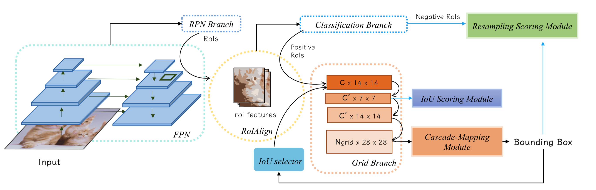
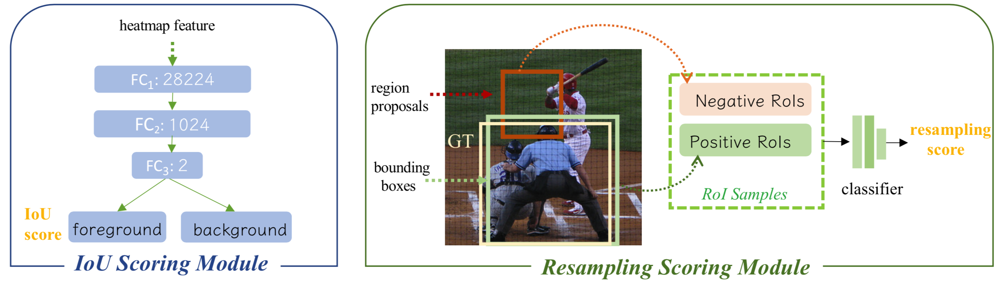

# CPM-R-CNN
CPM R-CNN: Calibrating Point-guided Misalignment in Object Detection

In this repository, we release the CPM R-CNN code in Pytorch.

- CPM R-CNN pipeline:
<p align="center"></p>

- Modules in CPM R-CNN:
<p align="center"></p>
<p align="center"></p>


## Installation
- 8 x TITAN RTX GPU
- pytorch1.1
- python3.6.8

- Other details will be public soon.

## Results and Models

**On MS COCO test-dev**

|  Backbone  |  LR  | mAP | AP50 | (APs/APm/APl) | DOWNLOAD |
|------------|:----:|:------:|:----:|:--------------------------:| :-------:|
|  R-50-FPN  |  2x  | 41.7   | 59.2 |      23.1/44.0/54.7        | None|
|  R-101-FPN  |  2x  | 43.3   | 61.2 |      23.9/46.3/56.6        | None|
|  X-101-FPN-DCN |  2x  | 46.4   | 65.3 |      26.8/49.4/61.0        | None|

**Component-wise performance**

|  CMM |  ISM | RSM | mAP |
|:-----:|:----:|:----:|:----:|
|       |      |      | 39.9 |
|  yes  |      |      | 40.7 |
|       |  yes |      | 40.5 |
|       |      |  yes | 40.6 |
|  yes  |  yes |  yes | 41.3 |       


**ImageNet pretrained weight**

- [R-50](https://drive.google.com/open?id=1EtqFhrFTdBJNbp67effArVrTNx4q_ELr)
- [X-101-64x4d](https://drive.google.com/open?id=1c4OSVZIZtDT49B0DTC0tK3vcRgJpzR9n)


## Training

To train a model with 8 GPUs run:
```
None
```


## Evaluation

### multi-gpu evaluation,
```
None
```

### single-gpu evaluation,
```
None
```