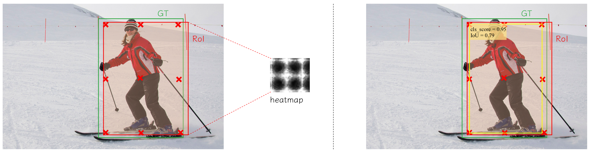

# CPM R-CNN: Calibrating Point-guided Misalignment in Object Detection

Bin Zhu, Qing Song, Lu Yang, Zhihui Wang, Chun Liu, Mengjie Hu

[[`arXiv`](https://arxiv.org/abs/2003.03570)]
## Introduction
In object detection, offset-guided and point-guided regression dominate anchor-based and anchor-free method separately. Recently, point-guided approach is introduced to anchor-based method. However, we observe points predicted by this way are misaligned with matched region of proposals and score of localization, causing a notable gap in performance. In this paper, we propose CPM R-CNN which contains three efficient modules to optimize anchor-based point-guided method. According to sufficient evaluations on the COCO dataset, CPM R-CNN is demonstrated efficient to improve the localization accuracy by calibrating mentioned misalignment. Compared with Faster R-CNN and Grid R-CNN based on ResNet-101 with FPN, our approach can substantially improve detection mAP by 3.3\% and 1.5\% respectively without whistles and bells. Moreover, our best model achieves improvement by a large margin to 49.9\% on COCO test-dev. Code and models will be publicly available.

<p align="center"></p>
>>>>>>> 4ecd9667e80cc11bb8c1f621c3e7b17ec27f5f6c

In this repository, we release the CPM R-CNN code in Pytorch.

- CPM R-CNN pipeline:
<p align="center"></p>

- Modules in CPM R-CNN:
<p align="center"></p>
<p align="center"></p>


## Installation
- 8 x TITAN RTX GPU
- pytorch1.5.1
- python3.7.0

- Other details will be public soon.

## Results and Models

**On MS COCO test-dev**

|  Backbone  |  LR  | mAP | AP50 | (APs/APm/APl) | DOWNLOAD |
|------------|:----:|:------:|:----:|:--------------------------:| :-------:|
|  R-50-FPN  |  2x  | 41.7   | 59.2 |      23.1/44.0/54.7        | [[GoogleDrive]](https://drive.google.com/open?id=1mwSGGziQNpq7mvRz7OlOIdfklJQBgDr9) [[BaiduPan]:a7k0](https://pan.baidu.com/s/1i5Kvbu4PCA6o4ktlx3P57w)|
|  R-101-FPN  |  2x  | 43.3   | 61.2 |      23.9/46.3/56.6        | [[GoogleDrive]](https://drive.google.com/open?id=1fj4iSGyVxf7oXvM-MZV4uVsvUH9Jdw-n) [[BaiduPan]:mpc8](https://pan.baidu.com/s/1IbfitzvycDrtm0Hh1SDBRw)|
|  X-101-FPN-DCN |  2x  | 46.4   | 65.3 |      26.8/49.4/61.0        | [[GoogleDrive]](https://drive.google.com/open?id=1ybwbP4xyYoTmH1bFv0dimkVTbpnp8FS-) [[BaiduPan]:enbd](https://pan.baidu.com/s/1YvW4Tb0nrgQADaLlay1tGQ)|

**Component-wise performance**

|  CMM |  ISM | RSM | mAP |
|:-----:|:----:|:----:|:----:|
|       |      |      | 39.9 |
|  yes  |      |      | 40.7 |
|       |  yes |      | 40.5 |
|       |      |  yes | 40.6 |
|  yes  |  yes |  yes | 41.3 |


**ImageNet pretrained weight**

- [R-50](https://drive.google.com/open?id=1_QXYuUbNUrRbsyPeYB9EJdwGp_SBFBrZ)
- [R-101](https://drive.google.com/open?id=1k1N1wuklAYuBD8DX229ZEMsp8opjDJNE)
- [X-101-64x4d](https://drive.google.com/open?id=1abiIjSUJXOZzxAX66aYjCSsWXGJp3z05)


## Training

To train a model with 8 GPUs run:
```
python -m torch.distributed.launch --nproc_per_node=8 tools/rcnn/train_net.py --cfg $CFG_NAME
```


## Evaluation

```
python tools/rcnn/test_net.py --cfg $CFG_NAME
```

## <a name="CitingCPM"></a>Citing CPM

If you find this work or code is helpful in your research, please cite:

```BibTeX
@article{zhu2020cpm,
  title={CPM R-CNN: Calibrating Point-guided Misalignment in Object Detection},
  author={Zhu, Bin and Song, Qing and Yang, Lu and Wang, Zhihui and Liu, Chun and Hu, Mengjie},
  journal={arXiv preprint arXiv:2003.03570},
  year={2020}
}
```
